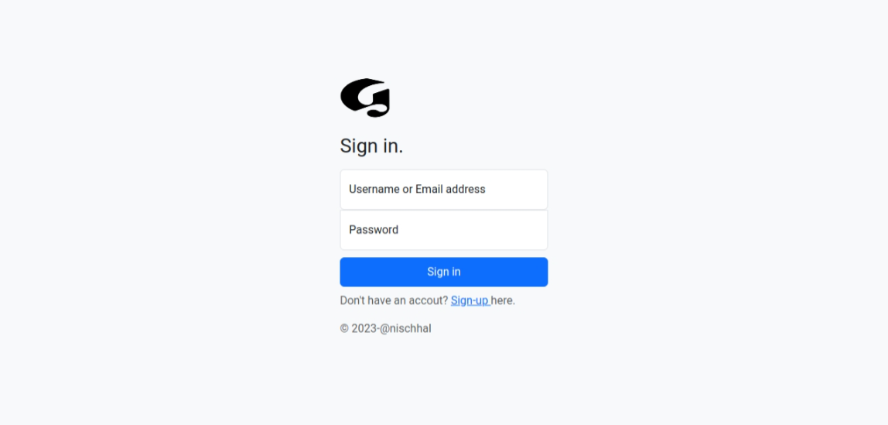
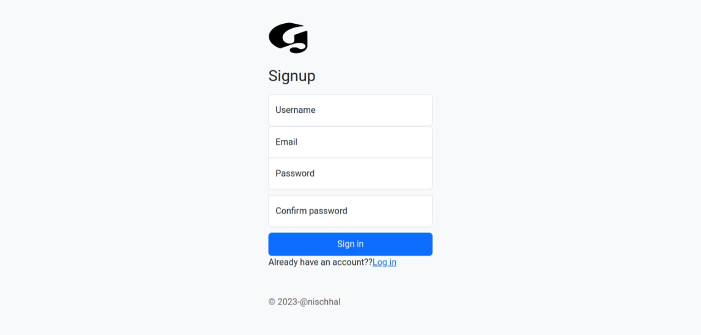
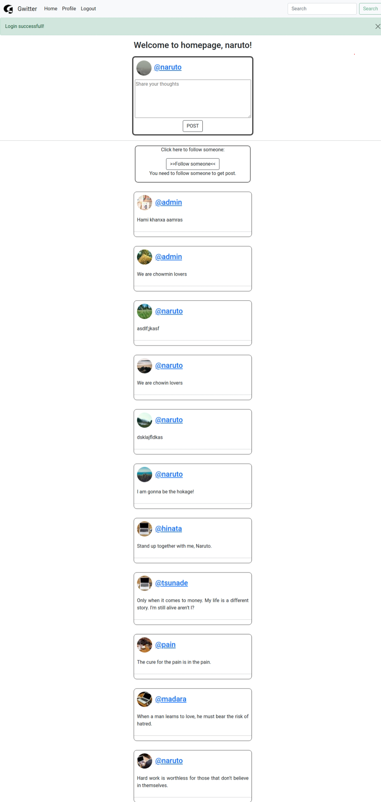
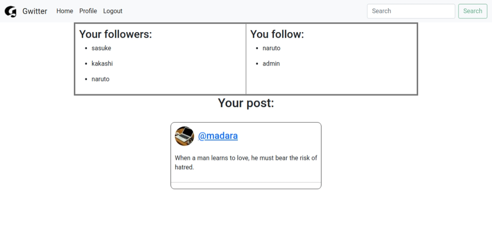

# Gwitter web app

## Overview

In this web-application, users can sign up and log in. Users cannot log-in if they get the password or username wrong.After login users can follow other users. The users will only get the post that they have followed.After getting on homepage the users can post their gweets.
The users can check on their profile by simply clicking their profile name and other users profile that they have followed.

## Running the docker
To run the docker file, first clone this repository.
Head over to its directory.Run this command:

`sudo chmod +x build-docker.sh`

This will give executable permission to `build-docker.sh` file.

then run:

`sudo ./build-docker.sh`

then you can visit site on [http://localhost:5000](http://localhost:5000)

### IMP: this app runs on port 5000.

# Preview

## Sign In

## Sign up

## Home page

## Profile page

